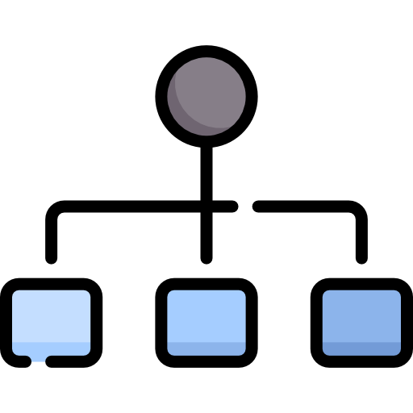

<a name="readme-top"></a>

<!-- PROJECT SHIELDS -->
[![Contributors][contributors-shield]][contributors-url]
[![Forks][forks-shield]][forks-url]
[![Stargazers][stars-shield]][stars-url]
[![Issues][issues-shield]][issues-url]
[![MIT License][license-shield]][license-url]
[![LinkedIn][linkedin-shield]][linkedin-url]


<!-- PROJECT LOGO -->
<br />
<div align="center">
  <a href="https://github.com/ujjwalgarg100204/Learning-Data-Structures-DSA">
    
  </a>

<h3 align="center">DSA in <u>C<u></h3>

  <p align="center">
    Data Structures and Algorithms in C programming language
    <br />
    <a href="https://github.com/ujjwalgarg100204/Learning-Data-Structures-DSA"><strong>Explore the docs »</strong></a>
    <br />
    <br />
    <a href="https://github.com/ujjwalgarg100204/Learning-Data-Structures-DSA">View Demo</a>
    ·
    <a href="https://github.com/ujjwalgarg100204/Learning-Data-Structures-DSA/issues">Report Bug</a>
    ·
    <a href="https://github.com/ujjwalgarg100204/Learning-Data-Structures-DSA/issues">Request Feature</a>
  </p>
</div>


<!-- TABLE OF CONTENTS -->
<details>
  <summary>Table of Contents</summary>
  <ol>
    <li>
      <a href="#about-the-project">About The Project</a>
      <ul>
        <li><a href="#built-with">Built With</a></li>
      </ul>
    </li>
    <li>
      <a href="#getting-started">Getting Started</a>
      <ul>
        <li><a href="#prerequisites">Prerequisites</a></li>
        <li><a href="#installation">Installation</a></li>
      </ul>
    </li>
    <li><a href="#usage">Usage</a></li>
    <li><a href="#roadmap">Roadmap</a></li>
    <li><a href="#contributing">Contributing</a></li>
    <li><a href="#license">License</a></li>
    <li><a href="#contact">Contact</a></li>
    <li><a href="#acknowledgments">Acknowledgments</a></li>
  </ol>
</details>


<!-- ABOUT THE PROJECT -->

## About The Project

This projects aims at making a data structures and algorithms library in C. As C does not come with basic data
structures like **Stack**, **Linked List** etc, out of the box, I wanted to implement each data structure to the best of
my knowledge and let internet integrate it in their project using [![Cmake][cmake]][Cmake-url].

## Stack

Stack is a linear data structure which follows a particular order in which the operations are performed. The order may
be LIFO(Last In First Out) or FILO(First In Last Out). [Source](https://www.geeksforgeeks.org/stack-data-structure/)


### Implementation of Stack

* Using
  [Static array](https://stackoverflow.com/questions/2672085/what-is-the-difference-between-static-and-dynamic-arrays-in-c) [[See code](data_structures/stack/static_array_implementation.c)]
* Using
  [Dynamic array](https://stackoverflow.com/questions/2672085/what-is-the-difference-between-static-and-dynamic-arrays-in-c) [[See code](data_structures/stack/dynamic_array_implementation.c)]
* Using
  [Linked List](https://www.geeksforgeeks.org/data-structures/linked-list/) [[See code](data_structures/stack/ll_implementation.c)]

### Applications

* Whether the expression has balanced
  bracket [[code]()]
* [Infix](https://www.codingninjas.com/blog/2021/09/06/infix-postfix-and-prefix-conversion/) to post fix
  conversion [[code]()]
* [Infix](https://www.codingninjas.com/blog/2021/09/06/infix-postfix-and-prefix-conversion/) to pre fix
  conversion [[code]()]
* Evaluation of
  prefix [[code]()]
  and
  postfix [[code]()]
  expression
* Conversion of decimal to
  binary [[code]()]
* Checking if the string
  is [palindrome](https://www.merriam-webster.com/dictionary/palindrome) [[code]()]

## Queue

A Queue is a linear structure which follows a particular order in which the operations are performed. The order is First
In First Out (FIFO). A good example of a queue is any queue of consumers for a resource where the consumer that came
first is served first. The difference between stacks and queues is in removing. In a stack we remove the item the most
recently added; in a queue, we remove the item the least recently
added. [Source](https://www.geeksforgeeks.org/queue-data-structure/)


### Implementation of Queue

* Using
  [Static array](https://stackoverflow.com/questions/2672085/what-is-the-difference-between-static-and-dynamic-arrays-in-c)[[code](data_structures/queue/non-circular/static_array.c)]
*

Using [Linked List](https://www.geeksforgeeks.org/data-structures/linked-list/) [[See code](data_structures/queue/non-circular/ll_implementation.c)]

### Circular Queue

A Circular Queue is a special version of queue where the last element of the queue is connected to the first element of
the queue forming a circle.The operations are performed based on FIFO (First In First Out) principle. It is also called
‘Ring Buffer’.In a normal Queue, we can insert elements until queue becomes full. But once queue becomes full, we can
not insert the next element even if there is a space in front of
queue. [Source](https://www.geeksforgeeks.org/circular-queue-set-1-introduction-array-implementation/)

### Implementation

* Using
  [Static array](https://stackoverflow.com/questions/2672085/what-is-the-difference-between-static-and-dynamic-arrays-in-c) [[code](data_structures/queue/circular/static_array.c)]
*

Using [Singular Circular Linked List](https://www.geeksforgeeks.org/circular-linked-list/) [[code](data_structures/queue/circular/ll_implementation.c)]

*

Using [Doubly Circular Linked List](https://www.geeksforgeeks.org/circular-linked-list/) [[code](data_structures/queue/circular/doubly_ll_implementation.c)]

## Dynamic Arrays

A dynamic array is an array with a big **improvement**: automatic resizing.
One **limitation** of arrays is that they're fixed currSize, meaning you need to specify the number of elements your
array will hold ahead of time. A dynamic array expands as you add more elements. So you don't need to determine the
currSize ahead of time. [[Source](https://www.interviewcake.com/concept/java/dynamic-array)]


### Implementation

* Using Dynamic memory allocation [[code](data_structures/dynamic_array/array.c)]

## Linked List

A linked list is a linear data structure, in which the elements are not stored at contiguous memory locations. The
elements in a linked list are linked using
pointers [[Source](https://www.geeksforgeeks.org/data-structures/linked-list/)]


### Implementation

* Singly Linked List [[code](data_structures/linked_list/singly/singly_ll.c)]
* Doubly Linked List [[code](data_structures/linked_list/doubly/doubly_ll.c)]
* Singly **Circular** Linked List [[code](data_structures/linked_list/circular_singly/singly_circular_ll.c)]
* Doubly **Circular** Linked List [[code](data_structures/linked_list/circular_doubly/doubly_circular_ll.c)]

<p align="right">(<a href="#readme-top">back to top</a>)</p>

### Built With

* [![C][C]][C-url]
* [![Cmake][cmake]][Cmake-url]

<p align="right">(<a href="#readme-top">back to top</a>)</p>


<!-- GETTING STARTED -->

## Getting Started

To include it in your project simply download the code and use it as shown

### Prerequisites

* Cmake [\[Download Cmake\]](https://cmake.org/download/)

### Installation

Clone the repo

   ```sh
   git clone https://github.com/ujjwalgarg100204/Learning-Data-Structures-DSA.git
   ```

<p align="right">(<a href="#readme-top">back to top</a>)</p>


<!-- USAGE EXAMPLES -->

## Usage

* To use any data structure simple include it in your source file by seeing through _easy to find file structure_ as
  shown
  [Stack Example](readme_assets/stack example.jpg)
  [Singly Circular](readme_assets/singly circular example.jpg)
  _For more examples, please refer to the [Documentation](https://example.com)_

See the [open issues](https://github.com/ujjwalgarg100204/Learning-Data-Structures-DSA/issues) for a full list of
proposed features (and known issues).

<p align="right">(<a href="#readme-top">back to top</a>)</p>


<!-- CONTRIBUTING -->

## Contributing

Contributions are what make the open source community such an amazing place to learn, inspire, and create. Any
contributions you make are **greatly appreciated**.

If you have a suggestion that would make this better, please fork the repo and create a pull request. You can also
simply open an issue with the tag "enhancement".
Don't forget to give the project a star! Thanks again!

1. Fork the Project
2. Create your Feature Branch (`git checkout -b feature/AmazingFeature`)
3. Commit your Changes (`git commit -m 'Add some AmazingFeature'`)
4. Push to the Branch (`git push origin feature/AmazingFeature`)
5. Open a Pull Request

<p align="right">(<a href="#readme-top">back to top</a>)</p>


<!-- LICENSE -->

## License

Distributed under the MIT License. See `LICENSE.txt` for more information.

<p align="right">(<a href="#readme-top">back to top</a>)</p>


<!-- CONTACT -->

## Contact

Ujjwal Garg - [@linkedin_handle](linkedin-url) - ujjwalgarg100204@gmail.com

Project
Link: [https://github.com/ujjwalgarg100204/Learning-Data-Structures-DSA](https://github.com/ujjwalgarg100204/Learning-Data-Structures-DSA)

<p align="right">(<a href="#readme-top">back to top</a>)</p>


<!-- ACKNOWLEDGMENTS -->

## Acknowledgments

* <a href="https://www.flaticon.com/free-icons/structure" title="structure icons">Structure icons created by Freepik -
  Flaticon</a>

<p align="right">(<a href="#readme-top">back to top</a>)</p>


<!-- MARKDOWN LINKS & IMAGES -->
<!-- https://www.markdownguide.org/basic-syntax/#reference-style-links -->

[contributors-shield]: https://img.shields.io/github/contributors/ujjwalgarg100204/Learning-Data-Structures-DSA.svg?style=for-the-badge

[contributors-url]: https://github.com/ujjwalgarg100204/Learning-Data-Structures-DSA/graphs/contributors

[forks-shield]: https://img.shields.io/github/forks/ujjwalgarg100204/Learning-Data-Structures-DSA.svg?style=for-the-badge

[forks-url]: https://github.com/ujjwalgarg100204/Learning-Data-Structures-DSA/network/members

[stars-shield]: https://img.shields.io/github/stars/ujjwalgarg100204/Learning-Data-Structures-DSA.svg?style=for-the-badge

[stars-url]: https://github.com/ujjwalgarg100204/Learning-Data-Structures-DSA/stargazers

[issues-shield]: https://img.shields.io/github/issues/ujjwalgarg100204/Learning-Data-Structures-DSA.svg?style=for-the-badge

[issues-url]: https://github.com/ujjwalgarg100204/Learning-Data-Structures-DSA/issues

[license-shield]: https://img.shields.io/github/license/ujjwalgarg100204/Learning-Data-Structures-DSA.svg?style=for-the-badge

[license-url]: https://github.com/ujjwalgarg100204/Learning-Data-Structures-DSA/blob/master/LICENSE.txt

[linkedin-shield]: https://img.shields.io/badge/-LinkedIn-black.svg?style=for-the-badge&logo=linkedin&colorB=555

[linkedin-url]: https://linkedin.com/in/ujjwal-garg-3a5639243

[Cmake]: https://img.shields.io/badge/cmake-064F8C?style=for-the-badge&logo=cmake&logoColor=4FC08D

[Cmake-url]: https://cmake.org/documentation

[C]: https://img.shields.io/badge/The%20C%20Programming%20Language-000000?style=for-the-badge&logo=c&logoColor=white

[C-url]: https://en.wikipedia.org/wiki/C_(programming_language)
